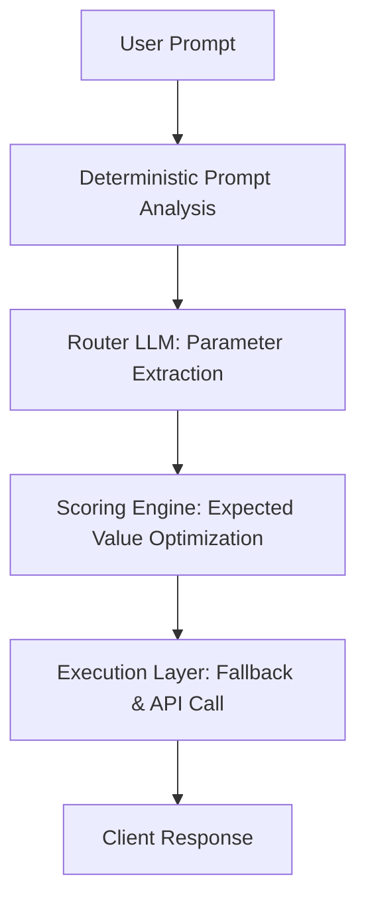

# Orion AI Router: Metadata-Driven AI Model Gateway

Orion is an intelligent, metadata-driven AI model routing gateway modeled after production-grade AI infrastructure (like OpenRouter or Coinbase's internal routing layers). It automatically evaluates every incoming prompt and routes it to the optimal model based on a dynamic **Expected Quality-to-Cost (Value) Score** rather than static, hardcoded rules.

---

## 1. Gateway Architecture & Workflow

The routing gateway is structured into three clean, decoupled layers:



### Step-by-Step Workflow:
1. **Deterministic Input Analysis**: The prompt is processed in pure TypeScript (zero LLM cost) to detect length, code snippets, mathematical formulas, translation requests, etc.
2. **Dynamic Context Preparation**: Orion queries the live OpenRouter API to fetch candidate models and merges them with the `config/capabilities.json` characteristics database.
3. **Intent Parameterization**: The router model (`openai/gpt-4o-mini`) acts as a fast semantic metadata extractor. It evaluates the user's prompt against the candidate registry and assigns capability weights (Coding, Reasoning, Latency importance, JSON reliability, etc.) needed to answer it.
4. **Expected Value Scoring**:
   The gateway runs a mathematical utility function across all candidates:
   $$\text{Value Score} = \frac{\text{Quality} \times W_{\text{quality}} + \text{Reasoning} \times W_{\text{reasoning}} + \text{Context} \times W_{\text{context}} + \text{Latency} \times W_{\text{latency}} + \text{Benchmark} \times W_{\text{benchmark}} + \text{Cost} \times W_{\text{cost}}}{\sum \text{Weights}}$$
   - **Cost vs Quality Optimization**: If Model A is $10\times$ more expensive but improves quality by only $2\%$, Orion selects Model B. If Model A is $2\times$ more expensive but improves quality by $30\%$, Orion selects Model A.
   - **Constraint Enforcement**: Models with context windows smaller than the estimated prompt + output size are automatically penalized to $0$ to prevent context overflows.
5. **Enrichment & Fallback**:
   - **Dynamic Confidence**: Calculated mathematically based on the score separation between the top model and the best alternative:
     $$\text{Confidence} = \text{clamp}(50\%, 99\%, 50\% + (\text{TopScore} - \text{BestAlternativeScore}) \times 3.2)$$
   - **Transaction Cost Estimation**: Calculates actual transaction pricing before executing the final call.
   - **Graceful Failure**: If any network/parsing failure occurs, Orion logs the diagnostic block (Raw output → Parse error → Validation error) and executes a safe fallback route.

---

## 2. Directory Structure

```bash
orion/
├── app/                  # Next.js web application layer
│   ├── api/chat/route.ts # Gateway controller orchestrating route selection & execution
│   └── page.tsx          # Premium client UI presenting routing metrics and chat
├── config/
│   └── capabilities.json # Characteristics registry (reasoning, coding, json reliability, etc.)
├── lib/
│   ├── modelCatalog.ts   # live catalog merging, dynamic preferred task generation
│   ├── openrouter.ts     # OpenRouter API client with exponential backoff & timeouts
│   └── routerAgent.ts    # core routing logic (weighted scoring prompt, schemas, parsers)
├── types/
│   └── index.ts          # Unified TS types and return interfaces
└── .env                  # Environment config (API keys)
```

---

## 3. Project Configuration & Metadata

### `config/capabilities.json`
Contains objective characteristics rather than static task mappings. This allows the router to dynamically infer model suitability:
```json
{
  "openai/gpt-4o": {
    "reasoning": 98,
    "coding": 96,
    "instructionFollowing": 99,
    "jsonReliability": 99,
    "longContext": 95,
    "multilingual": 97,
    "multimodal": true,
    "latency": "medium",
    "notes": "Excellent across nearly every capability. Premium model that should only be selected when higher quality meaningfully outweighs additional cost."
  }
}
```

### `types/index.ts`
All return interfaces are strictly defined for transparency:
- **`RouterCandidate`**: The minimal metadata block sent to the LLM.
- **`RouterAgentResponse`**: Validates scoring and metrics returned by the router engine.
- **`FinalRouterDecision`**: The enriched backend record returned to the client app.

---

## 4. Operational Telemetry & Fallbacks

Orion features a **3-stage staged error logging pipeline** to debug parsing failures:
1. **Raw response print**: Captures the exact string returned by the router LLM.
2. **JSON parsing**: Performs bracket-depth tracking (`extractFirstJsonObject`) to locate well-formed objects even if wrapped in markdown formatting.
3. **Zod validation**: Ensures all scores, selected IDs, and alternative fields conform to schema definitions.

If any check fails, Orion silently activates the default fallback model (`openai/gpt-4o-mini`) using default weights, guaranteeing **100% gateway uptime**.
